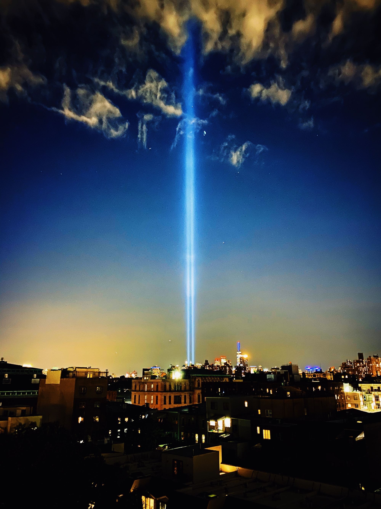

In this eternal year that mostly feels like living through the movie *Groundhog Day*, according to the calendar, yesterday was September 11. How it isn't a national holiday in honor of the people who died on that day nineteen years later feels almost as confusing as 2020 itself. But it's not.<!--more-->

Something curious happened yesterday that you may have come across. New York Times columnist and economist [Paul Krugman posted his account](https://www.fastcompany.com/90549597/new-york-times-writer-paul-krugmans-bad-9-11-tweets-have-united-the-country-against-him) of what transpired in this country following the tragedy. What I found notable was, aside from the fact that this wasn't his first attempt at putting a rosy spin on the infamous day and our nation's response, it had the rare effect of generating the ire of people across political ideologies. What I'm focusing on here is the general reaction his tweets generated, and I found an odd sense of hopefulness in a day of such stark ideological tribalism and political divide.

As I've marinated in my thoughts and feelings throughout the day, and this morning, I realized something I feel gets lost in conversations like this. Nineteen years later, we are a nation still bearing the marks and symptoms of PTSD from that day, and many of us experience this sort of dissociation as a result. Watching people dying, individually and collectively, over and over as there was little else shown on news networks for the following days on end.

Trauma does not rely on an event happening directly to a person, nor does it require physical proximity. The footage of the Two Towers on that morning was traumatic. We, collectively—as a nation—were traumatized on that day, not to mention people who experienced personal trauma. We have never healed from this as a nation. Many have recovered from their personal trauma related to that day, but we remain stuck in an ongoing trauma response.

What chance have we had as a country to heal collectively? Our response primarily involved increasing surveillance, security, and calming the acute anxiety we experienced in the aftermath. In other words, the response did not restore a sense of safety, but fed into our hyper-vigilance and encouraged further isolation.

Why this is problematic is one of the underlying tenets of trauma recovery: we only recover from communal trauma when we treat it in a communal context. The signs that this has not happened are all too apparent—one quick survey of politics today will tell you everything you need to know. We have allowed the effects of our trauma to tear us apart.

*(Trigger warning!)*

The terrorists are winning.

Sadly, another sign of PTSD is a lack of imagination. I find it telling that we may re-elect, to borrow [George Will's sentiment](https://www.washingtonpost.com/opinions/the-difference-between-trumpism-and-fascism/2020/07/09/377ae76e-c208-11ea-9fdd-b7ac6b051dc8_story.html), the most uninteresting and uninspiring authoritarian in modern history. Look at the severe backlash the movement to defund police has received to the point where the Democratic platform doesn't even mention it.

I recognize that several of you may disagree with this latter point as a lack of imagination; I urge you to ask why you disagree. I imagine the question may be triggering to some degree. While several people feel safer knowing we can call and people with guns will show up to our defense, I wonder if we are indeed safer in how we utilize the police today or if this is another form of security theater for white people?

I have not had a single occasion where someone showing up with a gun was either appropriate—representing an immediate escalation in the situation—or even helpful. I do recognize this is clear evidence of my privilege. Naturally, many minds will race to violent crime arguments, and indeed, I do not argue against limited cases where guns may be necessary. However, violent crime is far from the majority of crime in our country. Furthermore, where are the resources being spent to address the motivators for committing crime? Statistically, people commit crimes because they lack opportunity or resources, and they believe there is no other option. Addressing these issues is, in part, what I am talking about when I mention defunding the police.

Again, we cannot have this conversation or any conversation about coming together and unifying until we address the collective PTSD that renders us frozen in fear, hyper-vigilance, intrusive thoughts, and isolation. At once, I grieve for us, and yet I still hold onto a glimmer of hope. Hope for one day when Krugman's words are no longer quixotic.
